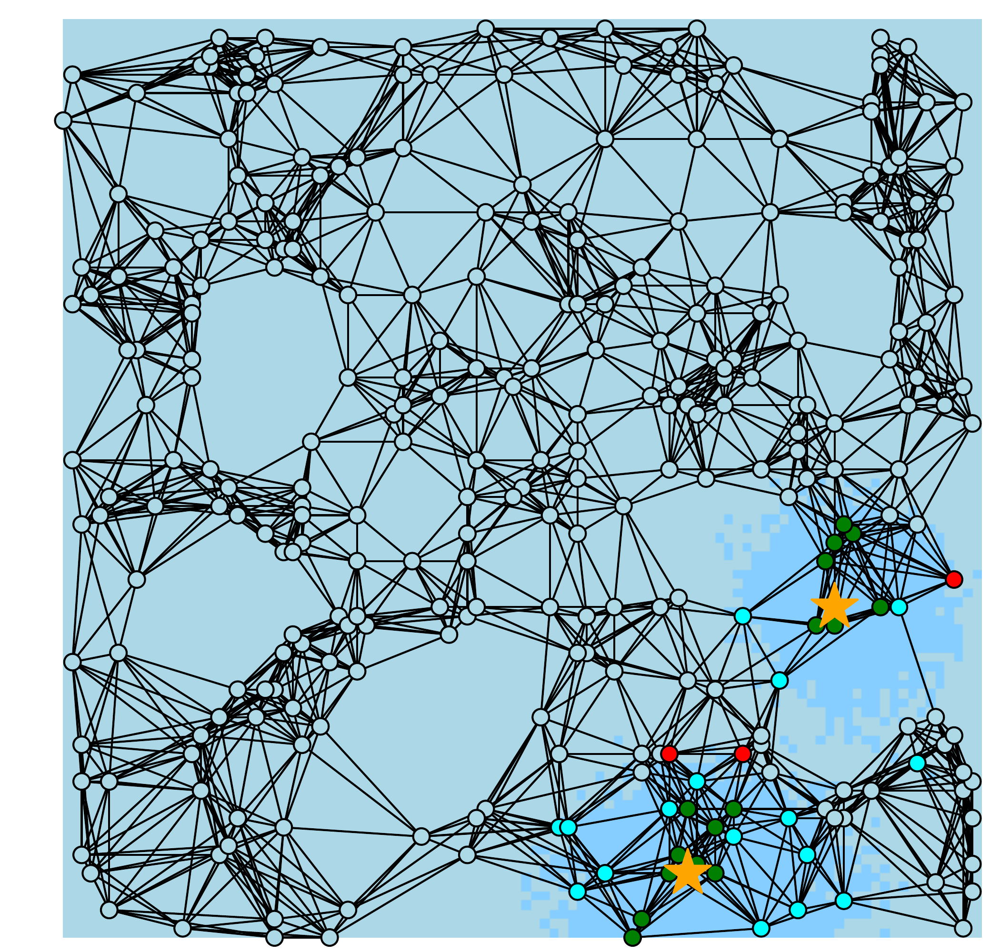
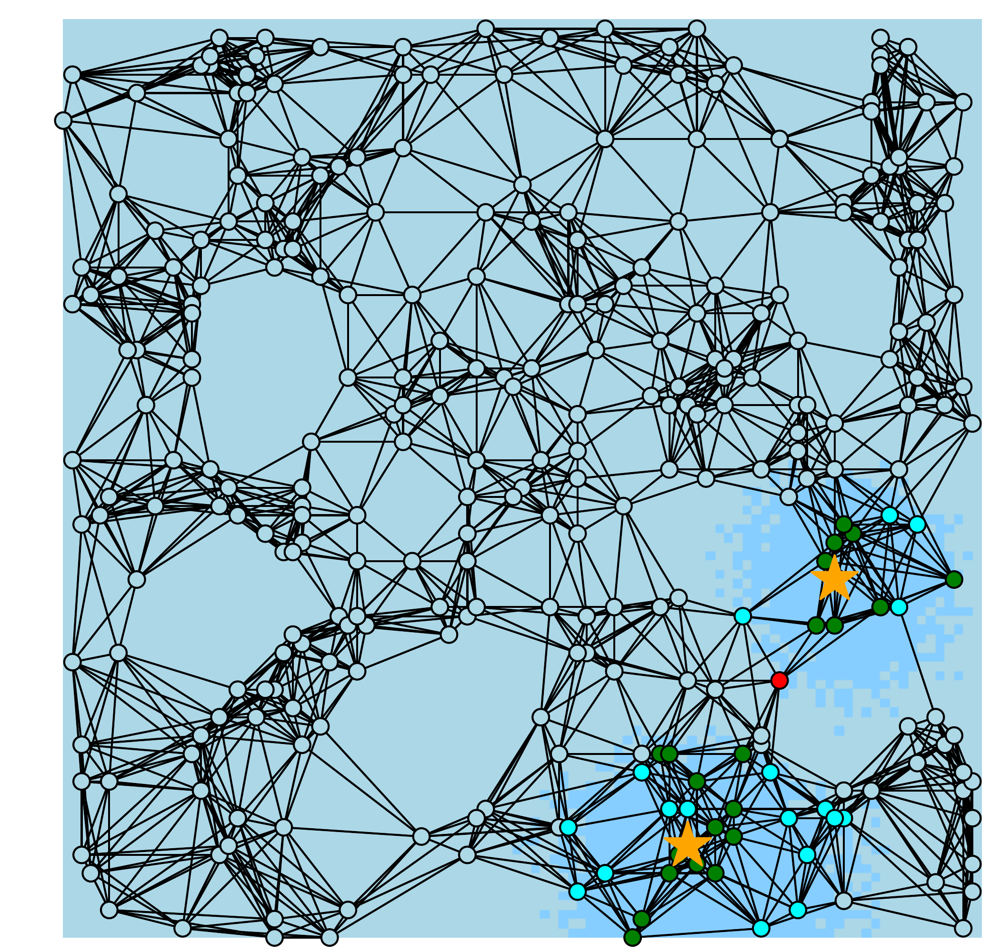
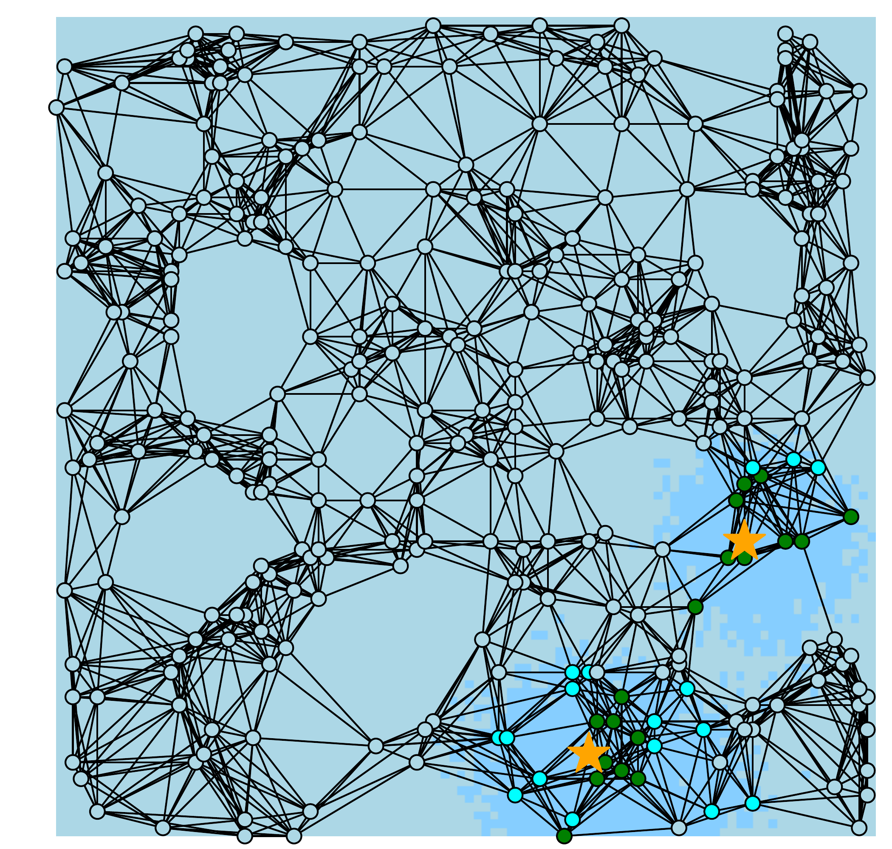

# A Graph Signal Processing Perspective of Network Multiple Hypothesis Testing with False Discovery Rate Control

## Introduction

This is the official implementation of the paper "[A Graph Signal Processing Perspective of Network Multiple Hypothesis Testing with False Discovery Rate Control](https://ieeexplore.ieee.org/abstract/document/11099058)".

## Illustration

| Instance 7 | Instance 8 | Instance 9 |
|:-----------:|:-----------:|:-----------:|
|  |  |  |

Illustration of communication signal detection results over the network at different time instances (Fig. 6 in the paper). The orange stars show the transmitter's dynamic locations. In the background, the light blue color denotes the null region, while a deeper color denotes the alternative region. On the graph, the light blue color represents correctly identified nulls, and the green color represents correctly rejected alternatives. Cyan represents undetected alternatives, and red represents incorrectly rejected nulls. 

## Prerequisites
Create a virtual environment and install the requirements:
```
conda create --name env_name python=3.9.21
conda activate env_name
cd path/to/this/repo
pip install -r requirements.txt
```


## Implementation

1. Set the working directory to `/scripts`:
```
cd scripts
```

2. To generate Figs. 2-5:
```
python example_illus_straight_move.py 
```

3. To produce the experimental results:
```
python main.py --method_names MHT-GGSP MHT-GGSP_cens MHT-GGSP_reg lfdr-sMoM BH FDR-smoothing SABHA AdaPT # Fig. 7
python main_straight_move.py # Fig. 8
```
The produced figures can be found in the subfolders of the folder `/results`.

The communication dataset is generated by 
```
python comm_data_fast_fade_generate.py
```

## Remark
the folder `/data_for_R` provides the data can be used by R.
You can change the fast fading channel model and parameters in the file 
`scripts/parameters.py` and run the file to simulate the field under different scenarios. After that,
specify the data and results path in `scripts/utils.get_config`.

If you use git commit and allow it to replace LF by CRLF, then you may get errors when trying to load 
.pkl files. You can use the following command to avoid this issue:
```
git config --global core.autocrlf false
```
More details about this issue can be found [here](https://gist.github.com/NateWeiler/df202280ce8cc38e9f00dbc17708fab2).

## Citation
If you use this code in your research, please cite the following papers:

X. Jian, M. Gölz, F. Ji, W. P. Tay, and A. M. Zoubir, “A graph signal processing perspective of network multiple hypothesis
testing with false discovery rate control,” *IEEE Trans. Signal Process.*, vol. 73, pp. 3496–3512, 2025.

M. Gölz, A. M. Zoubir, and V. Koivunen, “Multiple hypothesis testing
framework for spatial signals,” *IEEE Trans. Signal Inf. Process. Netw.*,
vol. 8, pp. 771–787, 2022.